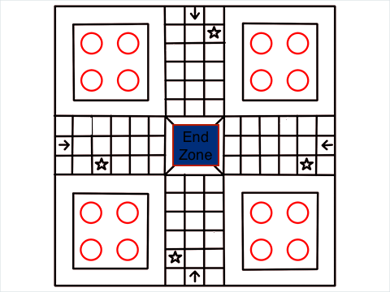

# Ludo

## The Game
Ludo is a strategy board game for two to four players, in which the players race their four tokens from start to
finish according to the rolls of a dice. This app is an emulation of the real board game, with the purpose of giving 
user the same experience and satisfaction a real ludo board would.

## Tech Being Used
* HTML
* CSS
* JavaScript

## Wireframe

## Approach Taken
The first step was creating the board, I made a base for each player where all four tokens would be originally placed, then I made the pathways the tokens would follow to get to their homes. I accomplished that by fixing in 18 divs in a main div and sorting their position out, I had a total of 72 divs created and gave each and every one of them an id of "box"i where i represent the number of the div id starting from 0 all the way to 71.
After the board was created I made the tokens using divs as well, to make each token movable. I used a setInterval to move the tokens around the board, since each players token had a different home the starting position was always different so I made a function that returns where each token should be whenever the function is called. For example the starting box for a yellow token would be div 40 and each token moves clock wise so when the token gets to box51 the function returns a 0 as the position for the next div.

## a link to the deployed live site 

https://jamesonwordi.github.io/Ludo/

## MVP Checklist
* Provide 4 starting zone for each player
* Provide paths for player
* Ability to choose which characters to move 
* Have a End zone players work towards
* Have a dice roll button

## Stretch Goal
* Different game modes
* A graphic representation of Die Roll
* Board Rotation
* Have moving characters

## Post-project Reflection
* Always have a layed out plan when embarking on any project, going with the flow would always bring confusion:
To always come up with a plan before starting any journey. I believe because I was too excited , I did not really come up with any base to always look to check if I was untrack, so I got carried away trying to come up with more complex ideas and this affected me while working on the project. 

* I learnt a lot while using addEventListeners, because of the game I choose eventListeners had to be on at certain period of the game and I didn't realize that I felt there was a way to put a pause to it, but had to figure out the hard way. I still believe there is a way to work without using conditional statement inside the Listeners so I'll keep on practicing using it.

* Lastly I learnt that writing codes for what one can relate to is always a fun thing to do, you'll always push yourself to accomplish it. Unlike this readme... But keeping records for other people to be aware of what is going on is important too, I've learnt that too .

## Credit/Sources
“How to Play Ludo” Wikipedia, wikiHow Staff, May 2, 2021, [URL](https://www.wikihow.com/Play-Ludo).
