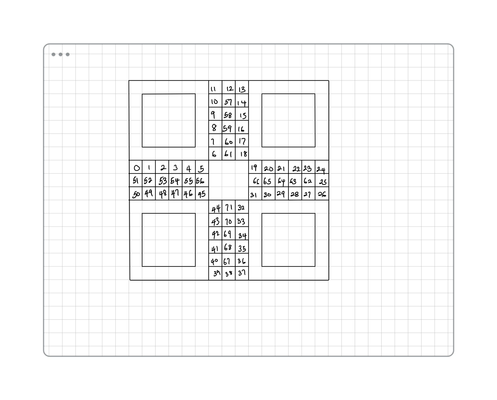

# Ludo

## Description Of The App

Ludo is a strategy board game for two to four players, in which the players race their four tokens
from start to finish according to the rolls of a dice. This app is an emulation of the real board game, it purpose is to give the user the same 
experience and satisfaction a real ludo board would. 

## Approach Taken
My first step was creating the board, I made a base for each player where all four tokens would be originally placed, then I made the pathways the tokens would follow to get to their homes. I accomplished that by compacting 18 divs in a main div and sorting their position out, i had a total of 72 divs created and gave each and every one an id of "box"i where i represent the number of the div id starting from 0 all the way to 71.

After the board was created I made the tokens, used divs as well for each token to make it movable. 
<!-- algorithm -->

## a link to the deployed live site 

https://jamesonwordi.github.io/Ludo/

## Technologies Used

I made use of HTML DIVs, button and the regular p and h1 tags
Made use of CSS, I got to play with flex and grid a lot since I had more than 71 divs to align
Lastly I made use of Javascript. EventListener pissed me off cause I didn't know if I could pause it or not,
but I think I bullied it instead, made use of the regular loops and conditional statements, also functions

## Post-project Reflection

It was a fun experience, I feel I didn't give my MVP enough attention at first cause I was so eager to start the project,
but lesson learnt, one needs to plan first before embarking on such adventures. also got to learn new error statements and also 
the importance of console.log when debugging. can't wait to learn new things and come back to edit this piece

## Sources Used

mdn was my friend for figuring out how some method worked
